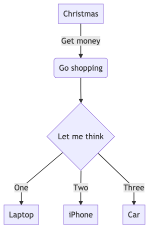
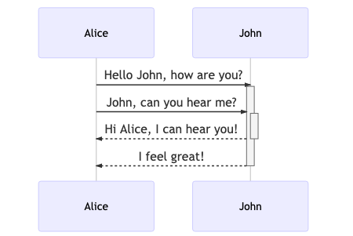
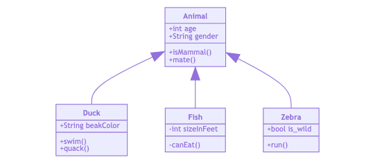
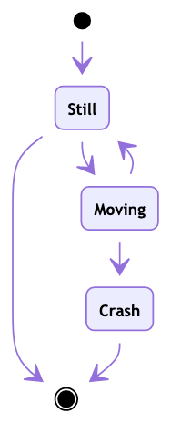
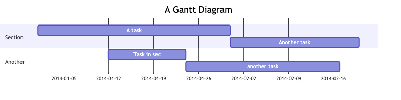
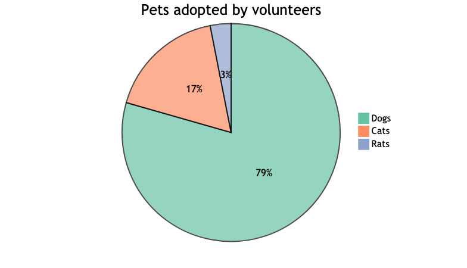
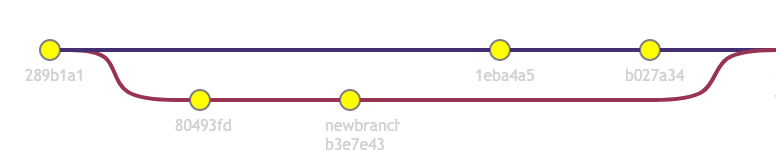
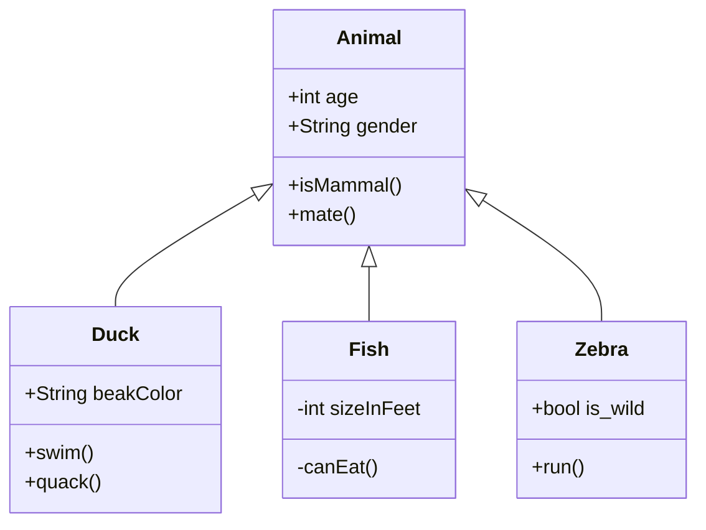

# Using Mermaid in Git README files

## Mermaid Diagrams

The [Mermaid Live Editor](https://mermaid-js.github.io/mermaid-live-editor/#/edit) has several sample diagrams. We want to create those here to ensure Mermaid is configured properly and works within Git.

### Flow Chart

This code produces this flow chart:

```code
graph TD
A[Christmas] -->|Get money| B(Go shopping)
B --> C{Let me think}
C -->|One| D[Laptop]
C -->|Two| E[iPhone]
C -->|Three| F[Car]
```




### Sequence Diagram

This code produces this sequence diagram:

```code
sequenceDiagram
Alice->>+John: Hello John, how are you?
Alice->>+John: John, can you hear me?
John-->>-Alice: Hi Alice, I can hear you!
John-->>-Alice: I feel great!
```




### Class Diagram

This code produces this class diagram:

```code
classDiagram
Animal <|-- Duck
Animal <|-- Fish
Animal <|-- Zebra
Animal : +int age
Animal : +String gender
Animal: +isMammal()
Animal: +mate()
class Duck{
	+String beakColor
	+swim()
	+quack()
}
class Fish{
	-int sizeInFeet
	-canEat()
}
class Zebra{
	+bool is_wild
	+run()
}
```




### State Diagram

This code produces this state diagram:

```code
stateDiagram
[*] --> Still
Still --> [*]
Still --> Moving
Moving --> Still
Moving --> Crash
Crash --> [*]
```




### Gantt Chart

This code produces this gantt chart:

```code
gantt
title A Gantt Diagram
dateFormat  YYYY-MM-DD
section Section
A task           :a1, 2014-01-01, 30d
Another task     :after a1  , 20d
section Another
Task in sec      :2014-01-12  , 12d
another task     : 24d
```




### Pie Chart

This code produces this pie chart:

```code
pie title Pets adopted by volunteers
"Dogs" : 386
"Cats" : 85
"Rats" : 15
```




### Git Graph

This code produces this Git graph:

```code
gitGraph:
options
{
    "nodespacing" : 150,
    "nodeRadius" : 10
}
end
commit
branch newbranch
checkout newbranch
commit
commit
checkout master
commit
commit
merge newbranch
```




### ER Diagram

This code is supposed to produce an ER diagram:

```code
erDiagram
CUSTOMER }|..|{ DELIVERY-ADDRESS : has
CUSTOMER ||--o{ ORDER : places
CUSTOMER ||--o{ INVOICE : "liable for"
DELIVERY-ADDRESS ||--o{ ORDER : receives
INVOICE ||--|{ ORDER : covers
ORDER ||--|{ ORDER-ITEM : includes
PRODUCT-CATEGORY ||--|{ PRODUCT : contains
PRODUCT ||--o{ ORDER-ITEM : "ordered in"
```

However it doesn't work as the [Mermaid CLI](#mermaid-cli) doesn't yet support the *erDiagram* type.


## Using Mermaid

### Visual Studio Code

Install the [Mermaid Preview](https://marketplace.visualstudio.com/items?itemName=vstirbu.vscode-mermaid-preview&ssr=false#overview). Once installed open the Mermaid Preview window. Whenever you position your cursor inside a Mermaid *fence*

```code


The resultant diagram will render in the Mermaid preview plane. This rendering happens with very little lag. This means you can put diagrams in your comments! You can of course create text files dedicated to the depiction of architecture diagrams, design documents and so forth. More importantly, you can keep these critical diagrams with your project and manage them using Git.

It should be noted that the VS Code Mermaid Preview was able to properly render *all* the Mermaid diagrams - including the ER Diagram!


### Mermaid CLI

[Mermaid.cli](https://www.npmjs.com/package/@ismarslomic/mermaid.cli) is a command line utility transforming input files containing Mermaid code into a PNG (or SVG) file as a result. This is an important capability because not all browsers render Mermaid correctly, and even for the ones that do there's significant rendering lag time when viewing on the AEP network.


### Hugo

Due to the rendering lag time issues noted in the [Mermaid CLI](#mermaid-cli) section, it is not recommended that you inline your Mermaid code when creating markdown for Hugo. Instead install the [Mermaid CLI](#mermaid-cli) and create and use PNG files instead. 

For example, the [Flow Chart](#flow-chart) image was created as follows:

1. Create flowchart code in the *flowchart.mmd* file

2. Run the following [Mermaid CLI](#mermaid-cli) command:<br>
<code>mmdc -i flowchart.mmd -o flowchart.png</code><br>
to produce the *flowchart.png* image.

3. Reference the *flowchart.png* image in your markdown as follows:<br>
<code>! [Flow Chart] (flowchart.png)</code><br>
(remove the spaces)

4. Done!

This isn't as convenient as letting the browser render the Mermaid code, but it's much faster and yields much more consistent results.

